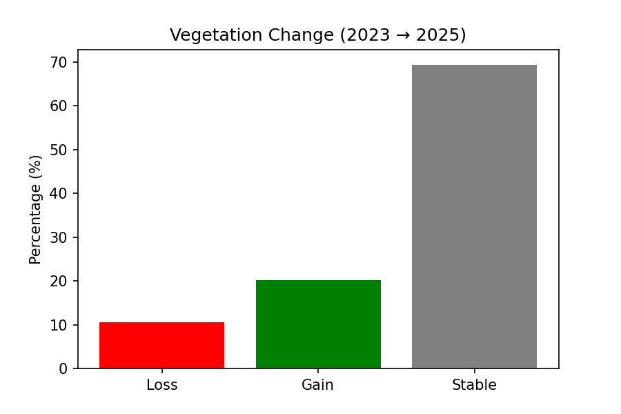

# 🌍 Satellite Imagery Change Detection

[](https://colab.research.google.com/github/Vedik-Kothari/satellite-change-detection/blob/main/Satellite_Change_Detection.ipynb)
👤 Maintainer: **Vedik Kothari** ([@Vedik-Kothari](https://github.com/Vedik-Kothari))


**Unsupervised NDVI-based change detection** using Sentinel-2 imagery and Google Earth Engine.  
Detects vegetation loss/gain between two time periods and clusters NDVI values (low/medium/high vegetation) using K-Means.

---

## ✨ Features
- Fetches **Sentinel-2 Harmonized** imagery from Google Earth Engine
- Computes **NDVI** for two user-defined periods
- Highlights vegetation **loss/gain/stable** areas
- **K-Means clustering** of NDVI values (unsupervised ML)
- Outputs: change statistics (CSV), bar charts, cluster histograms, GeoTIFFs

---

## 📊 Example (Delhi, 2023 → 2025)
- Vegetation Loss: **~10.49%**
- Vegetation Gain: **~20.18%**
- Stable Vegetation: **~69.32%**



---

## 🛠 How to Run
1. Open the notebook directly in Colab:  
   [](https://colab.research.google.com/github/YOUR_USERNAME/satellite-change-detection/blob/main/Satellite_Change_Detection.ipynb)

2. Authenticate Earth Engine when prompted.  
3. In the **User Inputs** section, set your:
   ```python
   roi = ee.Geometry.Rectangle([min_lon, min_lat, max_lon, max_lat])
   start_date_1 = "YYYY-MM-DD"
   end_date_1   = "YYYY-MM-DD"
   start_date_2 = "YYYY-MM-DD"
   end_date_2   = "YYYY-MM-DD"
